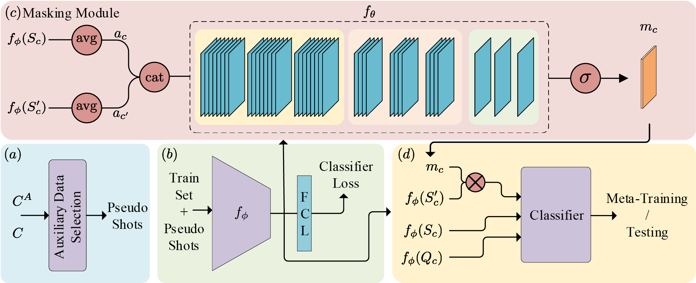

# Extended Few-Shot Learning: Exploiting Existing Resources for Novel Tasks

Code for [Extended Few-Shot Learning: Exploiting Existing Resources for Novel Tasks](https://arxiv.org/abs/2012.07176).



## Setup
Run the following in the project root to create the required directory structure.
```
mkdir ../data_root
mkdir ../data_root/mini-imagenet
mkdir ../data_root/tiered-imagenet
mkdir ../data_root/cifarfs
mkdir ../data_root/fc100
```
Download and extract the compressed file for each dataset to the corresponding directory.

* [mini-ImageNet](https://drive.google.com/file/d/1ymtHXsfqdweRcQn6JE4pjt6vFXwcaHgk/view?usp=sharing) 
* [tiered-ImageNet](https://drive.google.com/file/d/1_xXHOenGwT2scZ-d8MhnXCG-Uc5ht4sy/view?usp=sharing)
* [cifarfs](https://drive.google.com/file/d/1-wPhCsKTvP1rVVqbqwL6yjkh6x4mvgWq/view?usp=sharing)
* [fc100](https://drive.google.com/file/d/1ZacfPbfuebAuryX2t3GT9_mCH9SAxP17/view?usp=sharing)

Download and extract the compressed meta-data file to `../data_root` directory.

* [meta-data](https://drive.google.com/file/d/1FZwm_9vg2Z50SATcwFVKkeC4s5FUhCZG/view?usp=sharing)

You can download our pre-trained variables for each model here:
* Nearest Centroid Classifier (NCC) - [link](https://drive.google.com/drive/folders/16Fwz6fBmhvjShZdFMX02HDllwgP22_Wg?usp=sharing)
* Relation Module (RM) - [link](https://drive.google.com/drive/folders/1BrG0Aiu7BL8TEpee2xXBYtRB_7981A3W?usp=sharing)
* Embedding Adaptation (EA) - [link](https://drive.google.com/drive/folders/15QxLaXX1ltoSyNLylFh-v6j4bgrC34iH?usp=sharing)

## Requirements

Install the following packages in your environment.

```text
python=3.8.3
torch=1.5.1
cuda=10.1
torchvision=0.6.1
scipy=1.5.0
scikit-learn=0.23.1
pandas=1.1.1
opencv-contrib-python=4.5.2.54
flatten_dict=0.4.0
filelock=3.0.12
tqdm=4.61.1
tensorboardx=2.4
pyyaml=5.4.1
h5py=2.10.0
```


## Evaluation

To evaluate a model run the following command.
Use the following command to evaluate the 1-shot NNC model with basic embeddings on mini-imagenet dataset with level0 auxiliary data.

```commandline
python test_efsl.py --encoder-conifg configs/resnet12.yaml 
                    --model-checkpoint path/to/saved/parameters
                    --data-dir path/to/dataset/files
```

Run `python test_efsl.py --help` for the list of possible command line options and their description.

## Training

**Feature Embedding.** Use the following to train the feature embedding parameters on mini-imagenet dataset with level0 auxiliary data. 

```commandline
python train_classifier.py --config configs/classifier.yaml 
                           --data-dir path/to/dataset/files
```

Run `python train_classifier.py --help` for the list of possible command line options and their description.

**Masking Module.** Use the following to train the masking module parameters for 1-shot task on mini-imagenet dataset with level0 auxiliary data. 


```commandline
python train_efsl.py --encoder-config configs/resnet12-mask.yaml
                     --encoder-checkpoint path/to/resnet/parameters
                     --data-dir path/to/dataset/files
```
Run `python train_efsl.py --help` for the list of possible command line options and their description.


## Citation
If you use this repo, please cite the corresponding paper.

*Esfandiarpoor, R., Pu, A., Hajabdollahi, M. and Bach, S.H., 2020.*

```
@article{esfandiarpoor:arxiv20,
  Author = {Esfandiarpoor, R. and Pu, A and Hajabdollahi, M. and Bach, S. H.},
  Title = {Extended Few-Shot Learning: Exploiting Existing Resources for Novel Tasks},
  Volume = {arXiv:2012.07176 [cs.LG]},
  Year = {2020}}
```

## Acknowledgement
The code in this repo is based on the following repositories:
* [A New Meta-Baseline for Few-Shot Learning](https://github.com/yinboc/few-shot-meta-baseline)
* [Rethinking few-shot image classification: a good embedding is all you need?](https://github.com/WangYueFt/rfs/)
* [Few-Shot Learning via Embedding Adaptation with Set-to-Set Functions](https://github.com/Sha-Lab/FEAT)
